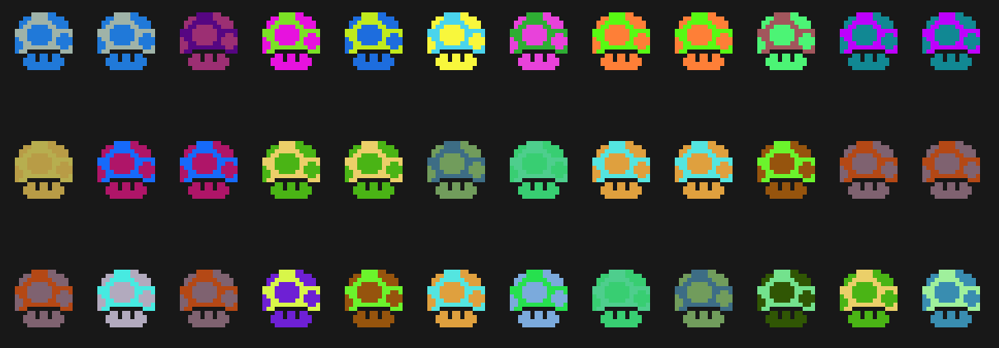

Blockies
========

A tiny library for generating identicons for Ethereum addresses or from strings.




Use
---

```javascript
  let icon = createIcon({
      text: "",
      pxSize: 5
      });

document.body.appendChild(icon); // icon is a canvas element
```
